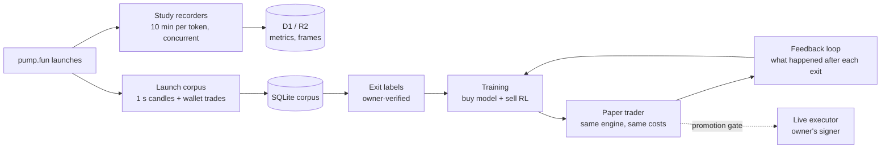

<div align="center">

# Pump Research Desk

**A research system that learns when to buy and when to sell pump.fun launches, from the first second of trading.**


</div>

---

## Overview

Pump Research Desk watches new pump.fun tokens from launch, records the first ten minutes of each one, and turns
those recordings into training data for two decisions:

| Decision | Question | Model |
|---|---|---|
| **Buy / skip** | Is this launch worth entering, a few seconds after it starts trading? | Logistic, MLP (PyTorch), gradient-boosted trees |
| **Sell** | Given everything seen so far, sell now or keep holding? | Stopping model (PyTorch) and offline reinforcement learning (fitted Q-iteration) |

Every result is scored by one accounting engine with a realistic **2 s execution delay** and **3.25% cost per side**
(1.25% fee + 2% slippage). Nothing is promoted from paper to real money without passing a written gate.

## How it works



1. **Collect.** Cloudflare Durable Objects record many launches at once, each for a fixed ten-minute window. A
   separate collector stores 1-second candles and every wallet-level trade.
2. **Label.** For each launch, the best realistic exit is computed with the delay applied: the earliest fill within
   10 points of the peak that is still net positive. Losers are labelled to exit immediately. Labels are reviewed by
   the owner before training.
3. **Train.** Buy models and sell policies are trained on a chronological 60/20/20 split. Thresholds are chosen on
   validation only; the test set is scored once.
4. **Paper trade.** The dashboard runs the chosen rules on live launches and logs every candidate, order, fill and
   skip reason.
5. **Learn from mistakes.** After each exit the system shows what the price did next, so wrong exits become new
   training examples. Rule changes require the owner's approval.

## Repository layout

```
src/            Cloudflare Worker: study recorders, paper trader, execution layer, AI analysis
public/         Dashboard pages: studies, paper trading, observer, lab
research/       Python research engine: accounting, features, training (PyTorch)
scripts/        Corpus collector, label builders, analysis and export tools
data-analysis/  Reviewed datasets, exit labels and model-review reports
docs/           Live-trading plan and full operations reference
migrations/     D1 schema
test/           TypeScript test suite
```

## Quick start

**Worker and dashboard** (Node 22+, Wrangler logged in):

```sh
npm ci
npm run check        # typecheck
npm test             # 111 tests
npm run dev          # local Worker
npm run deploy       # production
```

**Research pipeline** (Python 3.12):

```sh
python -m venv .venv && source .venv/bin/activate
pip install -r research/requirements.txt

# Collect launches (candles + wallet trades) into SQLite
python scripts/build_launch_corpus.py --db artifacts/corpus/launches.db

# Engine tests
python -m unittest research/test_engine.py

# Train buy models and sell policies, score against the current rules
python -m research.train --db artifacts/corpus/launches.db --out artifacts/corpus/train-v1
```

`artifacts/` is git-ignored; it holds the corpus database, model weights and run logs.

## Current status

| Area | Status |
|---|---|
| Concurrent 10-minute studies | Deployed |
| Paper trading (rules v3: sell half at +30%, trail, -25% stop) | Deployed, auto-apply off |
| Exit labels v4 | Owner-reviewed |
| Training pipeline v0 | Running on the growing corpus |
| Wallet-level trade collection | Collecting |
| Live trading | Not enabled; see the plan below |

Early results on the held-out test set: buy models reach an AUC of about 0.72, and the RL sell policy doubles the
win rate over the fixed rules. No combination is profitable yet after costs, so paper trading continues while the
corpus grows.

## Path to real money

Switching to live trading is a configuration change, not a rewrite. Paper and live share the same order and fill
records, the same risk checks and the same profit formula (`src/execution.ts`). Live mode refuses to run without the
owner's signer.

**Promotion gate:** 200+ paper trades across 3+ days, with the lower 95% bound of profit per trade above the current
system. **Limits:** $2 per position, $11 budget, daily loss -$3, max drawdown -$4.

Details: [docs/LIVE_TRADING_PLAN.md](docs/LIVE_TRADING_PLAN.md)

## Documentation

- [Live trading plan](docs/LIVE_TRADING_PLAN.md): phases, signer, switch checklist
- [Operations reference](docs/OPERATIONS.md): dashboard, credentials, observer, studies, replay lab
- [System design review](data-analysis/ASTRA_SYSTEM_DESIGN.md): prediction model, RL and feedback-loop design
- [Data analysis](data-analysis/README.md): what each dataset contains

## Disclaimer

This is a research project. It runs in paper mode by default and makes no claim of profitability. Trading
newly launched tokens carries a high risk of total loss.

---

<sub>Copyright © 2026 Tim Astras. All rights reserved.</sub>
